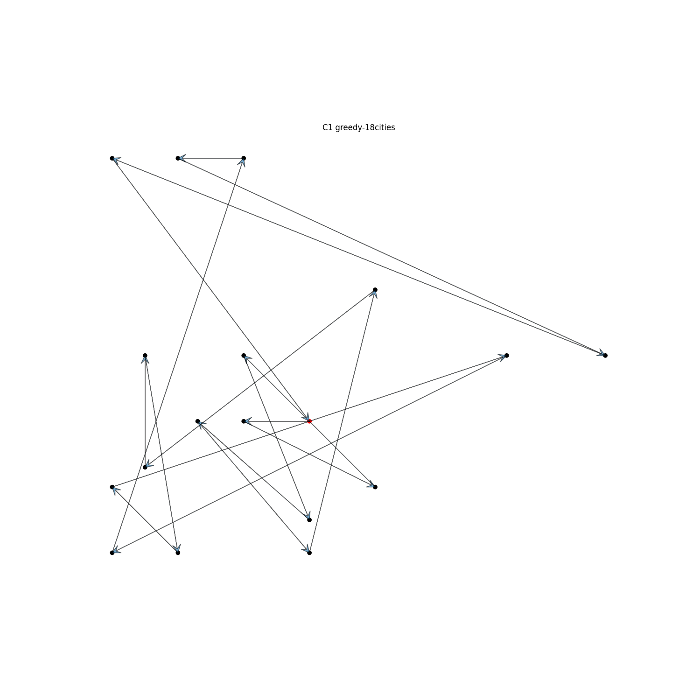
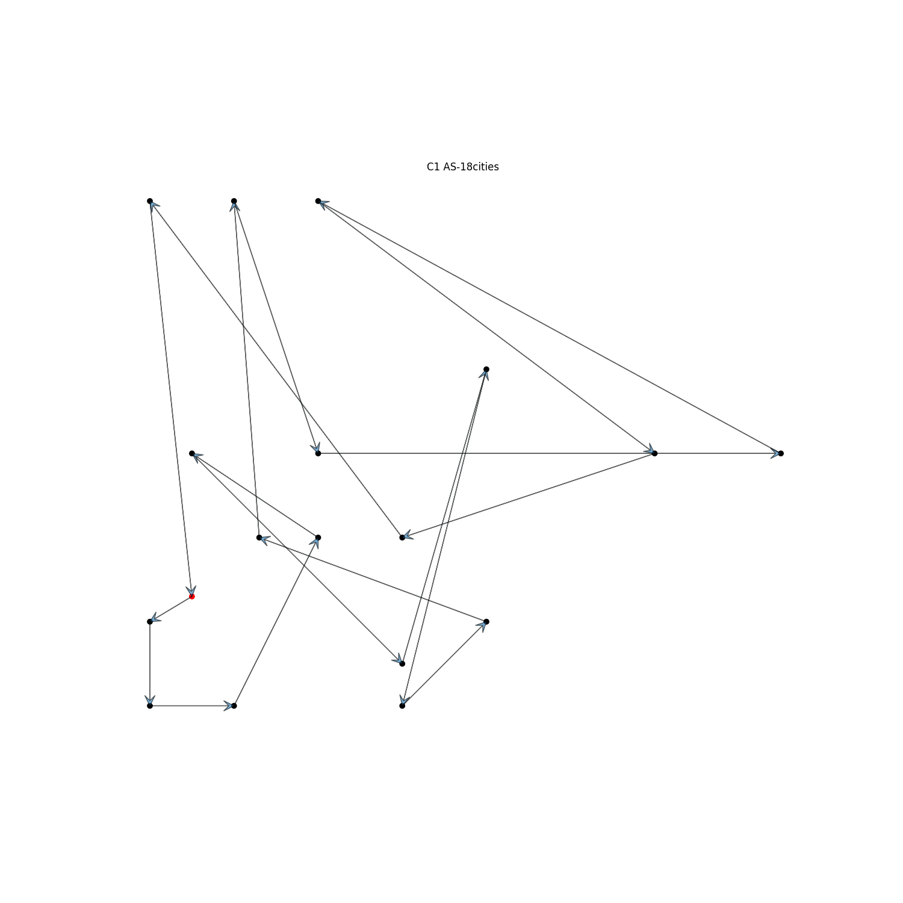
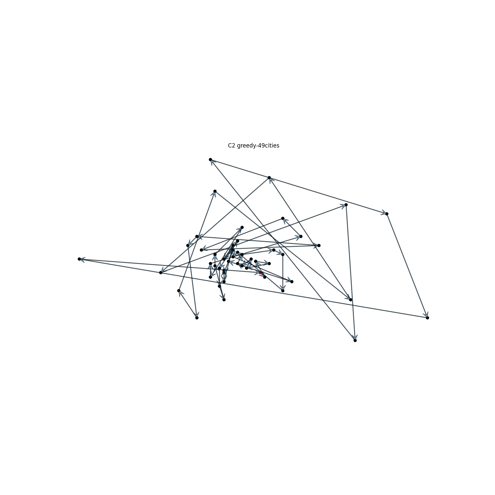
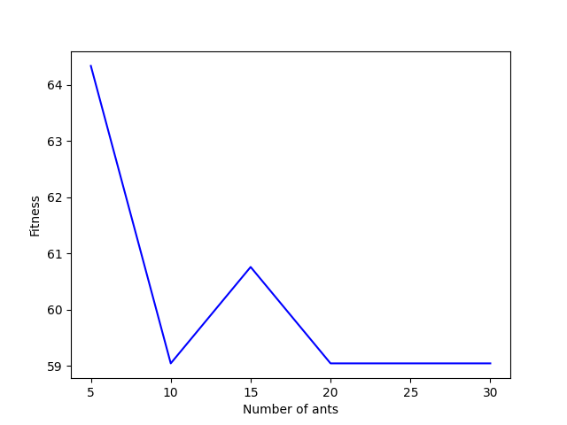
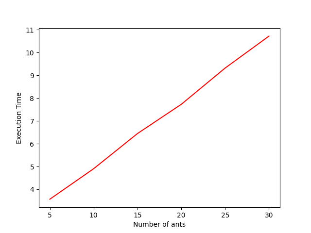
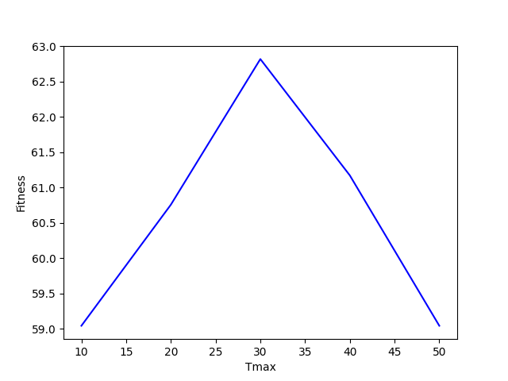
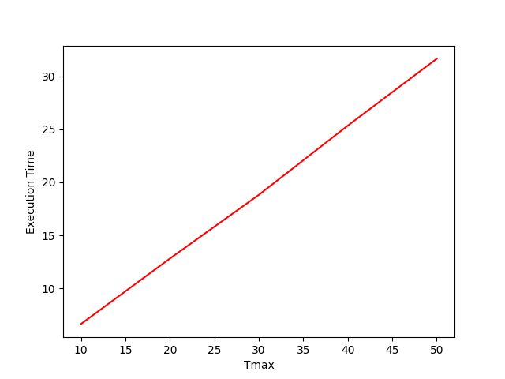

# Series 4: Ant System and Traveling Salesman Problem
# Fabrice Hategekimana
## Part2

I ran the AS algorithm on the two problems attached to the exercise.

### C1 greedy

Fitness: 68.94219525495825

### C1 AS

Fitness: 59.041375359730154  
tmax=10, ants=5, alpha=1, beta=1

### C2 greedy

Fitness: 7.193617974669268

### C2 AS

Fitness: 59.041375359730154  
tmax=10, ants=5, alpha=1, beta=1

The fitness is better with the Ants System in the c1 setting. But The fitness appear to be better in the c2 setting.

---

I also tried to analyze the influence of the m and t_max parameters to the quality of the solutions.
I tried it to c2.

The fitness tend to diminish when we increase the number of ants.
In the contrary, the computing time increase linearily. It's due to the fact I didn't use a parallel algorithm, that could easely reduce the result (similar as a AS with a single ants if we can have one thread per ants).

Strangely, the tmax seems to increase a bit the fitness with 30 iterations. For what I see, increasing the number of iterations doesn't seem to improve greatly the fitness. For what I see, increasing the number of iterations doesn't seem to improve greatly the fitness.

# Conclusion

It appear that the Ant System perform better than the Simulated annealing in the time departement. In fact, one can reduce the time taken with parallelisation (it's also scalable).

By depositing and updating pheromone levels on paths, the Ant System encourages convergence toward the best solutions over iterations. 

I didn't tried to modify the $\alpha$ $\beta$ $\rho$ parameters but I know they play a role for tuning the kind of approach we want (exploration vs convergence). 

$\alpha$ can manage the weight of the pheromone let by ants. In the other hand $\beta$ can reduce or increase the influence of distances between cities. Those two have a determinant role for choosing the next city to explore.

$\rho$ has also an influence with the pheromones. It decide the influence of the pheromones over time. It indicate the evaporation rate. If the evaporation rate increase, the pheromones won't have a significative impact in the long run and will favorise exploration over convergence.
