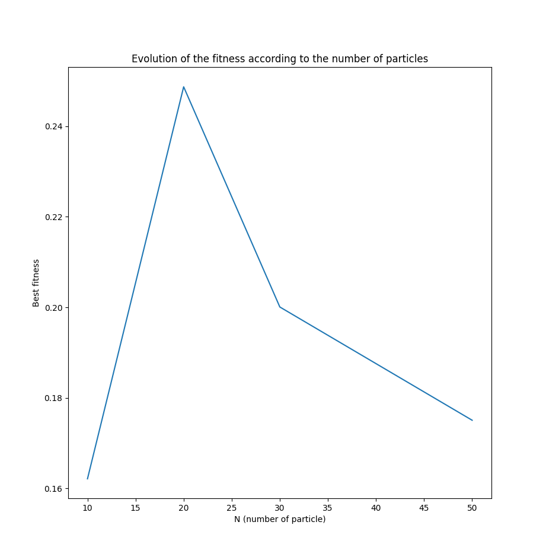
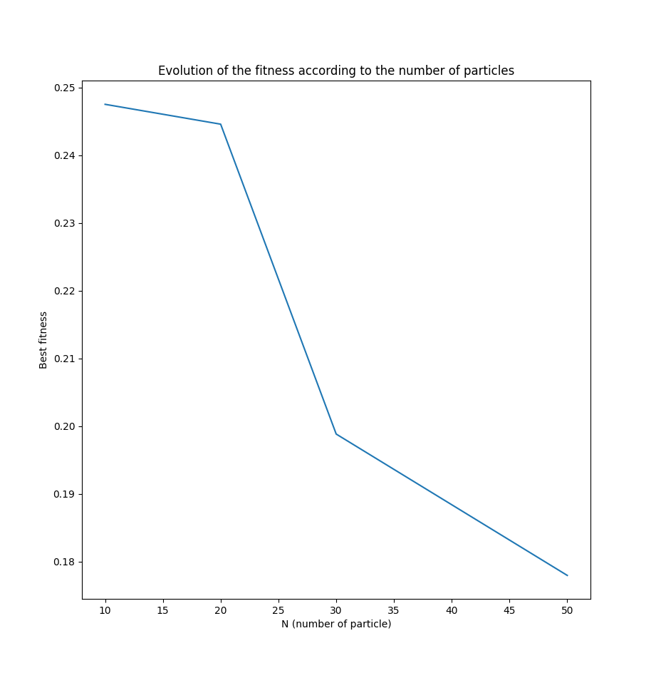
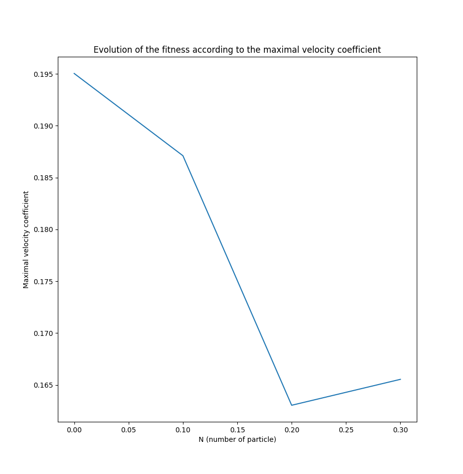
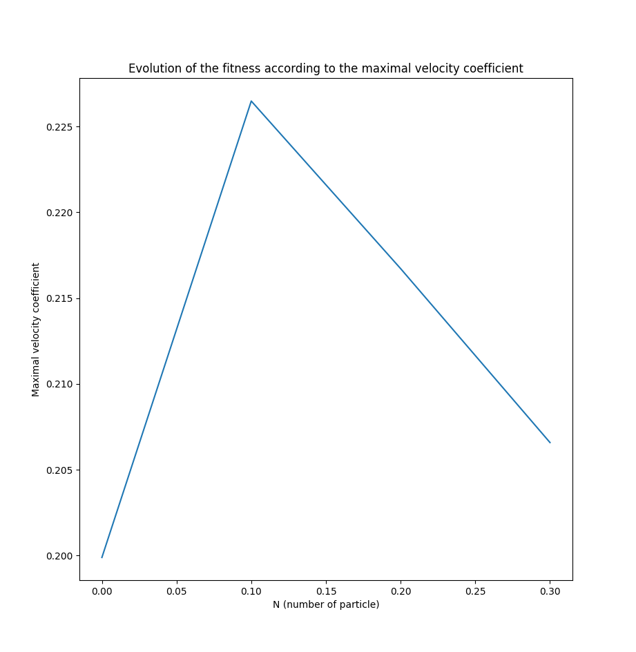

## How does the number of particles affect the result of the PSO algorithm?
I ran the algorithm for range of N, & plot best_fitness vs N (set vmax_coeff=0.1) with N = [10, 20, 30, 50].

Strangely, the algorithm doesn't alway give me the same graph each time. To be precise, I came across results in two categories.

I can conclude That having more particle help the algorithm for the exploration of most possibility in a given area.
We can say that it increase the chance of finding a very good extremum quickly, but it's still possible with less particles (but with less chances).

## How does the velocity cut-off vmax affect the result of the PSO algorithm?

I ran the algorithm for range of vmax_coeff, the cutoff velocity coefficient with a big N (I choose 50 according to the experiment above) vmax_coeff = [0, 0.1, 0.2, 0.3].

Like the experiment with the number of particle, increasing the velocity conduct to a better result. I will keep 0.3 as the velocity.

We can therefore affirm that increasing the maximum velocity helps the particles to explore a larger search area and therefore find good extrema more efficiently.

I ran the algorithm 10 times, noting the prediction accuracy (or error) for each run.
I noticed that I have a 50% accuracy rate every time, which is similar to randomly guessing the results. I realized that my h values are wrong, but I couldn't find the error in my code.

## Answering the following Questions:

### 1. What is the Search Space of our problem?
It's the set of position that each particle explore.

### Explain the coefficients c1 & c2
- c1 represent the weight of the personnal performance of each particle. If it's big, it mean that the particle will tend to go to the direction of it's best result. This parameter favor the exploration.
- c2 represent the weight of the global best performance. The particles will tend to it if the value is big. This parameter can favor the convergence.

## 3. How is PSO similar to Ant Algorithm?
Like the AS algorithm, the PSO allows you to play with parameters to promote exploration or optimization. It is also a metaheuristic algorithm based on the population where a group of individuals seek to find an individually and globally optimal solution.

